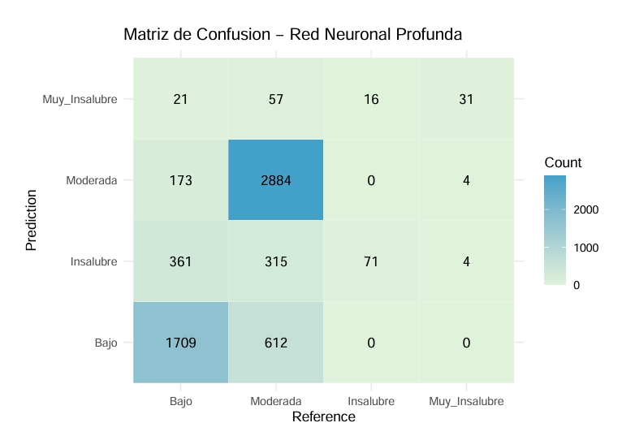
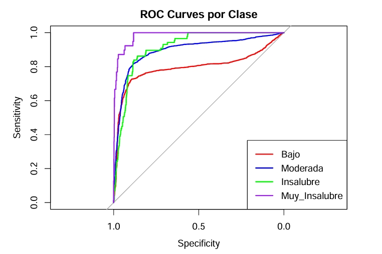
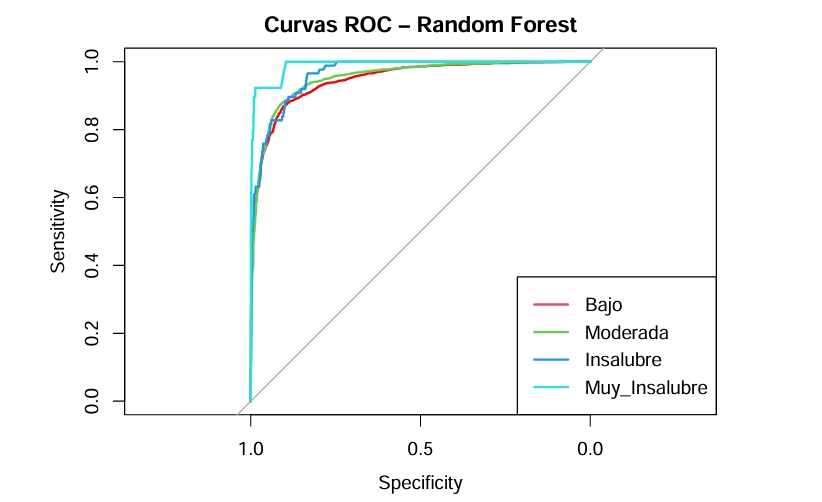
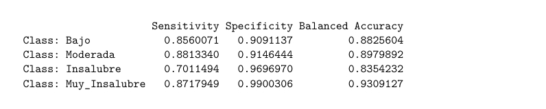

# PM2.5 Air Quality Classification using Deep Learning and Random Forest

This project focuses on classifying air pollution levels based on PM2.5 measurements using both Deep Learning and Random Forest models. The goal is to predict the air quality class (Bajo, Moderada, Insalubre, Muy_Insalubre) from sensor data using advanced machine learning techniques.

---

## 🔧 Tools and Libraries Used
- **Language**: R
- **Packages**: `keras`, `randomForest`, `caret`, `pROC`, `DMwR`, `ggplot2`
- **Techniques**: 
  - Data cleaning & balancing (SMOTE)
  - Neural Networks (Keras)
  - Random Forest
  - Model evaluation with ROC, confusion matrix, sensitivity & specificity

---

## 📊 Results

### Deep Neural Network
- Accuracy: ~75%
- ROC AUC and Balanced Accuracy used for performance evaluation

### Random Forest
- High AUC values across all classes
- Strong performance, especially in minority classes

---

##  Dataset Notice
> The dataset used in this project was provided for academic purposes and **cannot be publicly shared**. However, the code and structure are fully reproducible. You can adapt this project using your own tabular dataset.

---

## Additional Files
- `Data-Mining-Practice.Rmd`: R Markdown containing full code and explanation
- `Data-Mining-Practice.html`: rendered notebook preview

---

## Author
**Anıl Can Tekin**  
Master’s Student in Big Data – University of Murcia  

